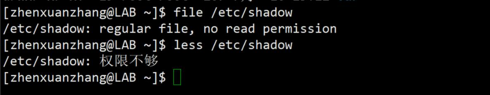

# linuxnote  

# 目录
* 操作文件和目录：[操作文件和目录]
	- 通配符： [wildchar]  
	- 创建目录：[mkdir]
	- 复制：[cp]
	- 移动或重命名：[mv]
	- 删除：[rm]  
	- 链接：[ln]
* 操作命令：[操作命令]
	- 了解命令类型：[了解命令类型]
	- 查看帮助：[查看帮助]
	- 关键字搜索命令全称：[关键字搜索命令全称]
	- 命令简介：[命令简介]
	- 别名：[别名]
* I/O重定向：[I/O重定向]
	- redirection：[redirection]
	- expansion：[expansion]
	- 展开屏蔽：[展开屏蔽]
	- 键盘高级操作技巧：[键盘高级操作技巧]
* 权限：[权限]
	- 身份：[身份]
	- id：[id]
	- chmod：[chmod]
	- umask：[umask]
	- change-role：[change-role]
	- chown：[chown]
	- passwd：[passwd]
* 进程：[进程]
	- ps：[ps]
	- top：[top]
	- kill：[kill]
	- shutdown：[shutdown]

# 操作文件和目录
## wildchar
- 通配符

- '*' : 0,1,more char
- ? : 1 char
- [character] : one char in set
- [!character] : not one char in set
- [[:class:]] : one char in class

- [:digit:] : number
- [:lower:] : lower char
- [:upper:] : upper char
- [:alnum:] : num + alpha
- [:alpha:] : low and upper

## mkdir 
- make directory 创建目录

- mkdir dir1
- mkdir dir1 dir2 dir3  

## cp 
- copy

- cp item1 item2  #把单个的文件或目录item1复制成item2
- cp item... directory #把多个文件复制到一个文件夹中
- options
		-a --archive #复制文件时把原属性（所有权，权限）也复制上
		-i --interactive #交互式的信息确认
		-r --recursive #递归，复制文件时把原文件下所有子文件也复制上
		-u --update #只复制更新内容
		-v --verbose #复制时提供详细信息
		
				

## mv 
- move 移动或重命名

- mv item1 item2
- mv item... directory

## rm 
- remove 删除
- rm item...
- option
		- f --force

注：linux没有还原命令

## ln 
- link 链接

- ln file link #创建硬链接
- ln -s item link #创建符号链接（软链接）

硬链接：一开始就有，文件与文件源数据（属性）有硬链接

缺点：不能指向目录；不能链接两个设备上的文件；不能看出两个文件的硬链接关系

符号链接：为了克服硬链接缺点而创建，比windows快捷方式还要早出。
删除符号链接文件不改变源文件

应用于版本更新，名字改变只需改软链接就行
foo ->foo2.1
foo ->foo2.3

硬链接：  

软链接：  

删除源文件后的软链接：  
  
符号链接可以对目录作链接：  

# 操作命令

	命令类型
	1. execute binary #可执行的二进制程序，显示颜色是绿色
	2. buildin bash #shell 内嵌
	3. shell function
	4. alias #别名

## 了解命令类型
- type command #返回cmd的类型

- which command #返回cmd的文件位置

  

## 查看帮助  
- help command #返回shell内嵌命令的帮助信息
- man command #manual 帮助手册
- 查看多页文档
- g 到页头 G 到页顶 
- ctrl+u 向上翻页 ctrl+d 向下翻页
- q 退出

## 关键字搜索命令全称  

- apropos keyword #搜索关键字寻找命令
- man -k keyword #功能同上

## 命令简介

- whatis cmd #比help简单，多为一行文字

- info keyword #树形结构，有超链接，比manual易懂
- 操作
	- n:next node
	- p:preview node
	- q:quit
	- u:up
	- enter:jump to link
	- space:pagedown

## 别名
- alias

- alias name='cmd string'

- alias #list alias cmd
- unalias name #remove alias cmd

# I/O重定向

## redirection
- stdout standard out device #标准的输出重定向到文件中
- stdrr standard error device 
- stdin standard input device

### redirect standard output 
- 重新编辑输出，一般输出到屏幕
- command > filename #用大于号编辑输出路径到一个文件
- 标准输出重定向生成的文件有字节，但错误命令重定向生成空文件
- 技巧：利用错误命令重定向可以清空文件内容，得到空文件

- command >> filename #输出追加

### redirect standard error
- 在大于号前加数字2
- 0:studio
- 1:stdout
- 2:stderr

### redirect stdout and stderr 
- 同时重定向标准输出和错误到一个文件
- ls -l . /bin/usr > ls-output.txt 2>&1
- 先错误输出然后正确输出
- ls -l . /bin/usr &>1 ls-output.txt 

### useless message

- /dev/null #相当于垃圾回收站
- ls -l /bin/usr 2> /dev/null

### redirect stdin

- cat file

- cmd < file

- ctrl+d  #退出cat

### pipe line 
- 管道线可以把多个命令组合起来使用
- cmd | cmd #一个命令的输出作为另一个命令的输入

### filter 
- 在管道线中加入过滤器，把输入数据经过转换再输入下一个命令
- sort #排序
- unique #去重复
- wc #word count
- grep pattern [file]
	- grep -i ignore caption #忽略大小写
- head -n 5 #打印前5行
- tail -n 5

- tee stdin/stdout #中间插入，得到中间结果

	ls -l /usr/bin | sort | uniq | wc -l
	ls -l /usr/bin | sort | uniq | grep zip
	ls -l /usr/bin | sort | uniq | head -5
	ls -l /usr/bin | sort| tee ls.txt | uniq | grep zip  
	

## expansion

- character expansion 
	- echo [string]
	- echo * #打印当前目录的所有东西，*为通配符，系统把符号展开了
	- 
- pathname expansion
	- echo *.txt

	- echo .* 
	- echo .[!.]*

- tilde expansion #波浪线展开
	- echo ~

- arithmetic expansion
		
		$((expression))
		支持 * - /  % **
		不支持小数
		echo $(((2*6)**3))

- brace expansion #花括号展开
	- echo Front-{A,B,C}-End
	- echo Num_{1,2,3}
	- echo {A..Z}
	- echo a{A{1,2},B{3.4}}b
	- mkdir {2010..2019}-{1..12} #创建月份文件

- parameter expansion #变量展开
	- echo $USER
	- printenv | less

- command substitution
	- 命令替换
	- $(cmd)

  

## 展开屏蔽

  

- quoting
	- double quotes  
	双引号  
	路径名，波浪线，花括号展开，空格分割失效  
	命令，算术，引用展开仍有效
	
	- single quotes  
	单引号  
	对展开禁用效果最强  
	命令，算术，引号展开失效

- escaping character 
	- 转义字符
	- \,\\, \$, \&, \!

## 键盘高级操作技巧

### move cursor 
-  移动光标
	-  C Ctrl
	-  A Alt
---
-  C-a 行首
-  C-e 行尾
-  C-f 向行尾一个字符
-  C-b 向行首一个字符
-  C-l 清屏
- clear 清空屏幕
---
- A-f 向行尾一个词
- A-b 向行首一个词

### modify text

- C-d 删除一个字符
- C-t 交换两个字符，与右边替换

- A-t 交换两个词
- A-l lower 把整个词小写，光标落在词首
- A-u upper

### copy & paste text

- C-k 剪切光标到行尾
- C-u 剪切行首到光标
- C-y 粘贴

- A-d 剪切光标所在词首一个单词
- A-Backspace 剪切光标所在词尾一个单词

### auto complete

- tab 自动补全
- double tab 自动补全全部

### history

- 命令历史
- history | less 防刷屏
- history | grep /usr/bin 查找命令
- ！num 执行某一个命令  

- C-p preview 上一条命令
- C-n next 下一条
- A-< history head
- A-> history end

- C-r research

# 权限

## 身份
- owner,group,other

	ls -l 长格式展示的第一项后九个字符就是文件的权限，
	第一个字符为文件属性，
	前3个代表所有者权限，中间3个是组权限，后三个是其他人权限  
	

	命令：
	id             显示用户身份号
	chmod    更改文件模式
	umask     设置默认的文件权限
	su             以另一个用户的身份运行 Shell
	sudo         以另一个用户的身份来执行命令
	chown      更改文件所有者
	chgrp        更改文件组所有权
	passwd     更改用户密码
	
---
## id
- id #显示用户身份号  
	- uid user id
	- gid group id 

- /etc/passwd user account
- /etc/group group info
- /etc/shadow password
---
- read,write,execute
- r,w,x

## chmod
- chmod change mode

  

	000无权限，001只执行
	010只写，100只读

- oct 八进制
	- chmod 600 filename or dirname
	

- sym 符号
	- u user -> owner
	- g group 
	- o other
	- a all = user + group + other #a可省略。默认是a
	- + 增加权限 
	- -
	- =
	- r,w,x

## umask
- umask 创建文件时设置默认权限
- 使用八进制来从文件属性中删除权限
- umask 默认权限是0002,后三位为002，对应删除other 的w，第二个权限

| origin file mode | --- rw- rw- rw- |
| :-: | :-: | 
| mask | 000 000 000 010 |  
| permission | --- rw- rw- r-- | 
| mask2 | 000 000 000 000 | 
| permission2 | --- rw- rw- rw- | 
| mask3 | 000 000 110 110 | 
| permission3 | --- rw- --- --- |  

- specify permission
	- setuid s 给可执行文件设置，把有效用户设置为所有者id  
	- setgid s 把有效用户组设置为所有者所在组id
	- sticky  t 控制共享目录

  

## change-role

- logout & login
- su
	- super user
	- su [-[l]] [user]  #l -表示l可省略
	- 变换身份，从普通用户变为root用户
	- su -c 'cmd'
	- 不切换用户，执行root环境下命令

 

- sudo 
	- super do
	- sudo cmd
	- sudo ls -l /root

## chown
- change owner or/and group
- chown [owner][:group] file 

## pssswd
- password
- passwd [user]

# 进程

	命令：
	ps          打印当前进程快照
	top         显示任务
	jobs        列出活跃的任务
	bg          把一个任务放到后台执行
	fg          把一个任务放到前台执行
	kill        给一个进程发送信号
	shutdown    关机或重启系统

## ps
- process
- ps
	- PID process id
	- TTY teletype
	- TIME 
	- CMD command
	- STAT status
	- %CPU cpu耗时
	- %MEM memory
	- VSZ vitual memory
	- RSS physical memory

- ps x
- ps aux

- status

## top
- 实时更新进程信息
- top

	- vi编辑器
	- :q!	quit vi
	- :!bash	goto bash
	- exit
---
	- crtl+c 中断进程
	- jobs 查看后台进程
	- vi& 查看进程地址
	- fg front ground 把后台进程放到前台
	- bg background 把进程放在后台进行
	- ctrl+z 终止进程 

## kill
- kill [-signal] PID...

## shutdown
- shutdown -h now 关机
- shutdown -r now 重启
