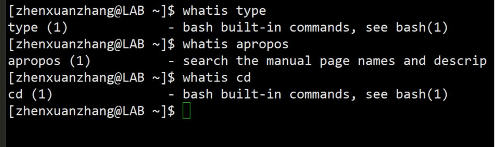

# linuxnote  

# 操作文件和目录
- 通配符： [wildchar 通配符]  
- 创建目录：[mkdir make directory 创建目录]
- 复制：[cp copy]
- 移动或重命名：[mv move 移动或重命名]
- 删除：[rm remove 删除]  

## wildchar 通配符

- '*' : 0,1,more char
- ? : 1 char
- [character] : one char in set
- [!character] : not one char in set
- [[:class:]] : one char in class

- [:digit:] : number
- [:lower:] : lower char
- [:upper:] : upper char
- [:alnum:] : num + alpha
- [:alpha:] : low and upper

## mkdir make directory 创建目录

- mkdir dir1
- mkdir dir1 dir2 dir3  

## cp copy

- cp item1 item2  #把单个的文件或目录item1复制成item2
- cp item... directory #把多个文件复制到一个文件夹中
- options
		-a --archive #复制文件时把原属性（所有权，权限）也复制上
		-i --interactive #交互式的信息确认
		-r --recursive #递归，复制文件时把原文件下所有子文件也复制上
		-u --update #只复制更新内容
		-v --verbose #复制时提供详细信息
		
				

## mv move 移动或重命名

- mv item1 item2
- mv item... directory

## rm remove 删除
- rm item...
- option
		- f --force

注：linux没有还原命令

## ln link

- ln file link #创建硬链接
- ln -s item link #创建符号链接（软链接）

硬链接：一开始就有，文件与文件源数据（属性）有硬链接

缺点：不能指向目录；不能链接两个设备上的文件；不能看出两个文件的硬链接关系

符号链接：为了克服硬链接缺点而创建，比windows快捷方式还要早出。
删除符号链接文件不改变源文件

应用于版本更新，名字改变只需改软链接就行
foo ->foo2.1
foo ->foo2.3

硬链接：  

软链接：  

删除源文件后的软链接：  
  
符号链接可以对目录作链接：  

# 操作命令

## 命令类型
1. execute binary #可执行的二进制程序，显示颜色是绿色
2. buildin bash #shell 内嵌
3. shell function
4. alias #别名

## 了解命令类型
- type command #返回cmd的类型

- which command #返回cmd的文件位置

  

## 查看帮助  
- help command #返回shell内嵌命令的帮助信息
- man command #manual 帮助手册
- 查看多页文档
- g 到页头 G 到页顶 
- ctrl+u 向上翻页 ctrl+d 向下翻页
- q 退出

## 关键字搜索命令全称  

- apropos keyword #搜索关键字寻找命令
- man -k keyword #功能同上

## 命令简介

- whatis cmd #比help简单，多为一行文字

- info keyword #树形结构，有超链接，比manual易懂
- 操作
	- n:next node
	- p:preview node
	- q:quit
	- u:up
	- enter:jump to link
	- space:pagedown

## alias

- alias name='cmd string'

- alias #list alias cmd
- unalias name #remove alias cmd

